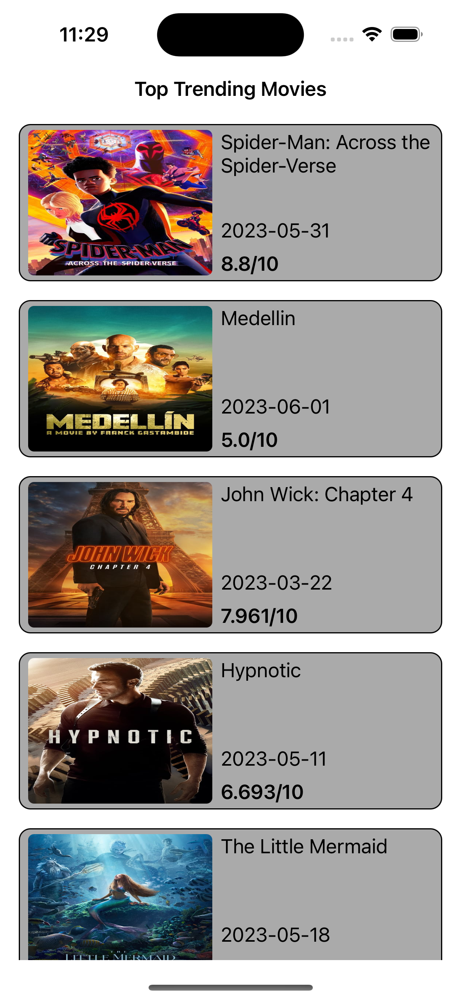

# MVVM-Pattern-UIKit

This is a project that can use API and shows all APIs details in a custom table view. I created this repo to show what I can do in UIKit and show my skills in swift. 

In this project you will see, MVVM pattern details, API calls and usage of controllers.

## Features

- Dark/Light Mode
- Detail Screen
- API call
- MVVM Design Pattern

  
## Screen Shots

  
